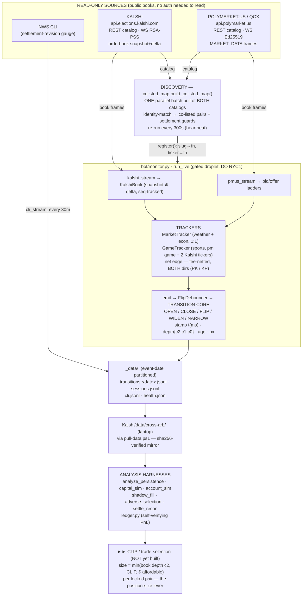

# Architecture — data flow, venues → bot

How market data moves from the two venues to a tradeable signal. This is the **system map**; it does not
restate the thesis ([CLAUDE.md](../CLAUDE.md)) or the module internals ([bot/README.md](../bot/README.md)).
Drawn to match the actual code paths in `bot/monitor.py` / `bot/colisted_map.py` / `bot/kalshi_book.py`.

**One-line read:** the monitor *observes* the whole co-listed universe in parallel and stamps each edge's
real book-crossing time; the first genuinely *strategic* decision is the **clip** (per-pair position size),
applied only when the bot acts on a transition. Everything left of the clip box is measurement.

> **Phase: READ-ONLY.** No orders are placed. The clip / trade-selection stage is **not yet built** — it is
> the read-only→trade boundary, and crossing it is gated ([decision 0006](../decisions/0006-deploy-on-digitalocean-consult-first.md)).

## Diagram (Mermaid — renders on GitHub)



## Diagram (ASCII — renders anywhere / terminal)

```
══════════════════ READ-ONLY INGEST  ·  gated droplet (DO, NYC1) ══════════════════

 ┌── KALSHI ────────────────────┐        ┌── POLYMARKET.US (QCX) ───────┐
 │ api.elections.kalshi.com     │        │ api.polymarket.us            │
 │  REST  catalog (series)      │        │  REST  catalog (markets)     │
 │  WS  /trade-api/ws/v2        │        │  WS  /v1/ws/markets          │
 │   RSA-PSS · snapshot+delta   │        │   Ed25519 · MARKET_DATA      │
 └───────┬───────────────┬──────┘        └──────┬───────────────┬───────┘
  catalog│         frames │                frames│        catalog │
         │                └───────┐    ┌─────────┘                │
         └──────────────┐         │    │         ┌────────────────┘
                        ▼         │    │         ▼
            ┌─────────────────────┴────┴─────────────────────┐
            │ DISCOVERY   colisted_map.build_colisted_map()   │
            │  • ONE full catalog pull, BOTH venues (parallel │
            │    batch — not market-by-market)                │
            │  • identity-match → co-listed pairs (no L1 FPs) │
            │  • settlement guards: bucket [lo,hi] equality,  │
            │    exact-date game bind, ≥-orientation, same    │
            │    NWS/BLS/BEA source   · re-run every 300 s     │
            └───────────────────────┬─────────────────────────┘
                register(): slug→fn(book) , ticker→fn(book)
                                    ▼
   ┌─────────────────── bot/monitor.py · run_live ──────────────────────┐
   │  kalshi_stream → KalshiBook (snapshot ⊕ delta merge, seq-tracked)   │◄ frames
   │  pmus_stream   → marketData bid/offer ladders                       │◄ frames
   │             │  (both WS run concurrently via asyncio.gather)        │
   │             ▼  set_book("K"/"P") / set_kalshi / set_pm              │
   │   TRACKERS   MarketTracker  (weather + econ, 1:1 binary)            │
   │              GameTracker    (sports, pm game + 2 Kalshi tickers)    │
   │             │  net edge — fee-netted, BOTH directions (PK / KP)     │
   │             ▼                                                       │
   │   emit() → FlipDebouncer → TRANSITION CORE                          │
   │            OPEN · CLOSE · FLIP · WIDEN · NARROW                     │
   │            stamp  t(ms) · depth{c2,c1,c0} · age · px                │
   └───────────────────────────────┬────────────────────────────────────┘
        NWS CLI ─(cli_stream 30m)─► │ ◄─ rest_heartbeat: +new mkts / prune settled
                                    ▼
            ┌──────────────────────────────────────────────┐
            │ _data/   (event-date partitioned)             │
            │  transitions-<date>.jsonl · sessions.jsonl    │
            │  cli.jsonl · health.json                      │
            └───────────────────────┬──────────────────────┘
                pull-data.ps1  (sha256-verified, idempotent mirror)
                                    ▼
            ┌──────────────────────────────────────────────┐
            │ Kalshi/data/cross-arb/   (laptop)             │
            └───────────────────────┬──────────────────────┘
                                    ▼
══════════════════════════ ANALYSIS  /  (future) BOT ══════════════════════════
   analyze_persistence · capital_sim · account_sim · shadow_fill ·
   adverse_selection · settle_recon          ledger.py  (self-verifying PnL)

   ┌─────────────────────────────────────────────────────────────────────┐
   │  ►► CLIP enters HERE — the trade-selection / sizing stage             │
   │     per locked pair:  size = min( book depth c2 , CLIP , $ affordable)│
   │     (today simulated in account_sim; the live bot is NOT yet built —  │
   │      this is the read-only→trade boundary, gated)                     │
   └─────────────────────────────────────────────────────────────────────┘
```

## Stage walkthrough

| Stage | Code | What it does / key property |
|---|---|---|
| **Sources** | — | Both venues' order books are **public** (auth only verifies read access). Kalshi WS is RSA-PSS-signed; polymarket.us WS is Ed25519-signed. NWS CLI is the settlement-revision side input. |
| **Discovery** | `bot/colisted_map.py` `build_colisted_map()` | **One batch catalog pull of both venues** (not market-by-market) → identity-matched co-listed pairs (no false positives, [L1](../tasks/lessons.md)) with **settlement-identity guards** (bucket `[lo,hi]` equality, exact-date game binding, ≥-orientation, same govt source). Re-run every heartbeat to pick up new days/games. ([0008](../decisions/0008-colisted-map-discovery-and-coverage-audit.md)) |
| **Subscribe** | `run_live` `pmus_stream` / `kalshi_stream` | pmus subscribed in shards of ≤100 slugs sent **back-to-back**; Kalshi all tickers in one message; **both WS run concurrently** (`asyncio.gather`). The whole ~200–300-market universe goes live within a fraction of a second — there is **no per-series "which first" sequencing**. |
| **Books** | `bot/kalshi_book.py` `KalshiBook` | Kalshi book reconstructed from `orderbook_snapshot` ⊕ `orderbook_delta` with a per-connection `seq` tracker (gap → resubscribe). polymarket.us frames carry the ladder directly. |
| **Trackers** | `MarketTracker` / `GameTracker` | Compute the cross-venue **net edge, fee-netted, in BOTH directions** (buy-YES-pmus/NO-Kalshi = `PK`, and the reverse `KP`). Weather + econ are 1:1 binary; sports is a 2-outcome game (pm game market + two single-team Kalshi tickers). |
| **Transitions** | `emit` → `FlipDebouncer` → transition core | Edge state machine: `OPEN/CLOSE/FLIP/WIDEN/NARROW`. Each record is stamped `t` (**ms precision**), `depth{c2,c1,c0}` (fillable contracts at gross marginal edge ≥2¢/1¢/0¢), `age` (book staleness), `px` (per-venue YES touches). The `open_t` is the **real instant the books crossed** — empirically ~97% genuine, only ~3% are restart re-emits. ([0003](../decisions/0003-event-driven-persistence.md) · [0005](../decisions/0005-dual-stream-persistence-monitor.md)) |
| **Output** | `_data/transitions-<date>.jsonl` etc. | **Event-date partitioned** so a market's whole lifecycle stays in one file across UTC midnight; `sessions.jsonl` marks restarts (restart-aware analysis); `health.json` is the liveness beacon. ([0009](../decisions/0009-event-date-partition-copy-keep-pull.md)) |
| **Pull** | `deploy/pull-data.ps1` | sha256-verified, idempotent mirror droplet → `Kalshi/data/cross-arb/`; finalized days gzipped + verified-moved. |
| **Analysis** | `scripts/*.py` + `bot/ledger.py` | The harnesses read the mirror. `ledger.py` is the self-verifying PnL core that the live bot would wire to signals. |
| **Clip / bot** | *(not yet built)* — modeled in `scripts/account_sim.py` | The **strategy lever**: per locked pair, `size = min(book depth c2, CLIP, $ affordable)`. Downstream of the edge signal — the bot decides position size when it acts on a transition. Crossing into live orders is gated. |

## Why the clip is real (not an artifact)

Everything up to the transition log is **observation** — the monitor watches all markets in parallel and
records when each edge genuinely appears. The clip is the **first decision the operator makes**: how much
size to commit per pair, bounded by the book's own depth and the remaining bankroll. Under a fixed bankroll
deployed greedily as edges cross in real time, the clip controls the diversification/concentration tradeoff
(see the `account_sim.py` sweep) — a genuine strategy parameter, which is why the same observed data yields
different PnL at different clips.

## Allocation policy: which arbs get the scarce bankroll (FIFO is *not* the plan)

`account_sim.py` deploys the bankroll **strictly FIFO by arrival** (`sorted(key=open_t)`). Measured on the
real data (`scripts/alloc_policy_experiment.py`, 0.86 d), that is the **worst** rule when the bankroll binds:
at $500 the first arb to cross is a deep sports clip that eats **~$500**, so FIFO funds **1 of 217**
candidates (after restart-censored phantoms are filtered — [L20]). Because capital is **locked to settlement** (no early-exit), the arbs competing for that bankroll
are spread across **days**, not seconds — so the intuitive fix of "wait 1 s and sort that batch largest-first"
(`batch1s`) reorders almost nothing: it captures only **~4%** of the FIFO→optimal gap and ties FIFO at $2 k,
while *adding* an entry-latency tax (`shadow_fill`, lag-corrected per [0013]: ~55% naked-leg at 1 s). The lever
that works is a **global edge threshold** (reservation price τ: skip thin arbs, keep powder for fat ones),
evaluated at arrival with **zero added fill latency** — allocation priority is a *bankroll-policy* decision
over days, never an execution delay.

**Tested out-of-sample** (`scripts/clip_threshold_test.py`, audited; **magnitudes corrected by [0013]** — the
published rows contained an econ settlement-phantom): the trustworthy claim is a **non-oracle fixed rule — a
hard ~2¢ edge floor (never lower) + a per-pair cap sized so the bankroll fully deploys without
over-concentrating (~10–20% here) — which beats FIFO by ~+9% (5% cap) to +141% (20% cap)** on a held-out late
window it was never tuned on (10 diversified weather+sports positions, econ-quarantined). The big in-sample
numbers (**+1744%**, and a fitted **+462%** OOS) are **oracle / single-observation artifacts**, not validation —
the +462% was 93% *one* econ contract that turned out to be the off-by-one settlement phantom; do not quote
them as results.
Three things the test surfaced: (1) the **clip cap alone is risk-control, not PnL** (−14% OOS corrected —
capping in FIFO order just diversifies into *thin* arbs; its job is bounding per-pair exposure against a
settlement-void / leg-fail, while the *threshold* does the return work; a 5% cap under-deploys, ~20% fully deploys);
(2) under a ≥0.5¢ friction haircut FIFO collapses to **$0** (its lone funded arb is sub-edge and the haircut
zeroes it) while the thresholded design stays positive — a one-position degeneracy at $500, but it shows why an
edge floor above the friction cost is load-bearing; (3) a **book-initialization phantom** (a 37.7¢ ITF-tennis
"arb" captured 1.5 s after a resubscribe during a restart storm — flat `c2==c1==c0` ladder, `censored=restart`)
was **75% of the old in-sample headline** until `capturable()` was fixed to drop restart-censored episodes
([L20]); the in-sample number fell from +7127% to +1744%, while the OOS conclusions barely moved (the phantom
lived in the in-sample half). Ordering remains **second-order to capital velocity** — no rule rescues throughput
while one clip locks the bankroll for ~15 d, and with a 2¢ floor only ~19 arbs clear in 0.81 d. Net: the (gated)
clip stage should adopt a **2¢ edge-floor + a deploy-to-full per-pair cap** over FIFO, but the magnitude is a
**method demo on <1 d / one event cluster** — real validation needs the weeks of multi-date data now accumulating
(K-fold over disjoint windows, friction inside the OOS arm, per-position bootstrap CIs).
